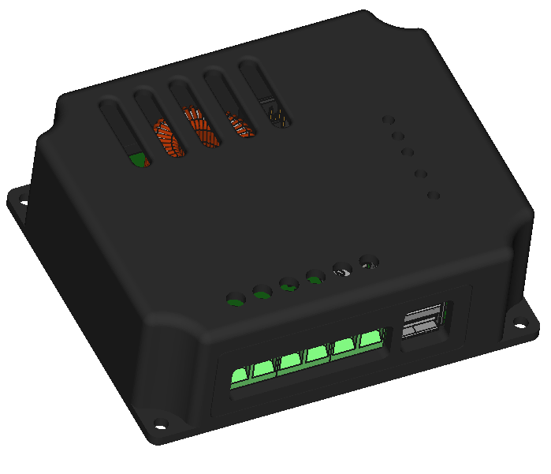
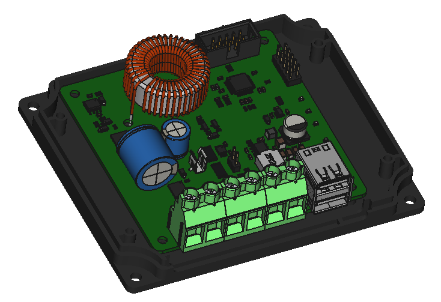

# Housing for Cloud Solar 10A MPPT charge controller

This housing developed for 3D-printing fits the [MPPT-1210-HUS v0.4](https://github.com/LibreSolar/MPPT-1210-HUS/tree/63e5842671172e69dc099e8ab838018fbf695d1a).

IMPORTANT NOTE: This housing only fits for **version 0.4**. For the newer **version >=v0.6** ([MPPT-1210-HUS](https://github.com/LibreSolar/MPPT-1210-HUS) ) please use the housing file of [MPPT-PWM-xUS](https://github.com/LibreSolar/charge-controller-housings/tree/master/MPPT-PWM-xUS).

Designer: [Rowan Spear](https://github.com/RSpear1) from [Connected Energy Technologies Ltd.](https://github.com/lastmileICT)

## Images

Complete housing incl. PCB:

Housing with top cover removed:

