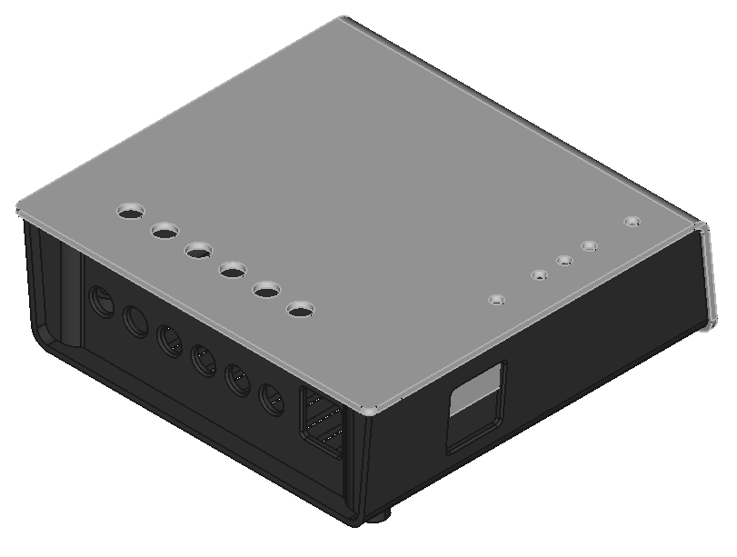
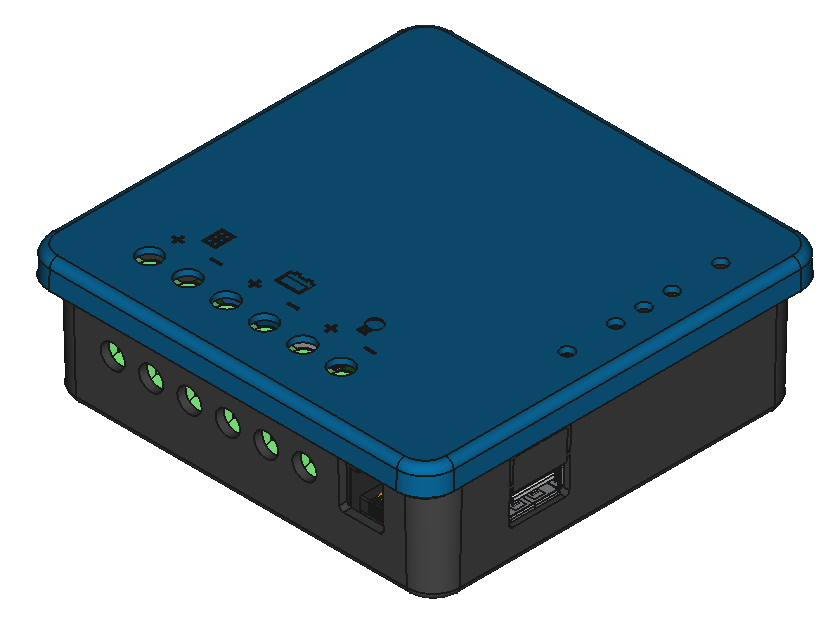

# Housing for charge controllers with USB charging and 6P6C serial connector

Suitable charge controller types:

- [MPPT-1210-HUS](https://github.com/LibreSolar/MPPT-1210-HUS) >=v0.6
- [PWM-2420-LUS](https://github.com/LibreSolar/PWM-2420-LUS)

Both housings were designed with injection molding in mind.

## Housing with L-shaped cover

Ideas:

- Upper venting outlets at the back so that dust and splash water cannot enter from top side (if wall-mounted)
- Cut-outs in PCB edges used for screw to fix housing

Issues:

- Space for 3 fixing screws very little
- Fixation of cover not easy without sliders in mold design

## Housing with rounded corners:

Ideas:

- Simple and straight-forward design
- Fixation to wall with keyhole slots
- Additional fixation with screw after removal of PCB possible.

Issues:

- Matching of LEDs and cover difficult during assembly.
